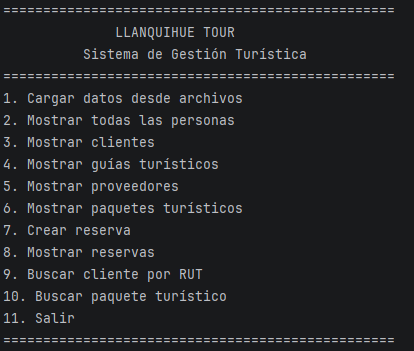
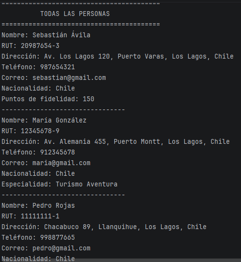
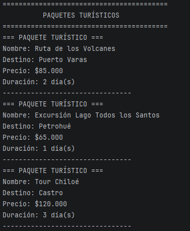
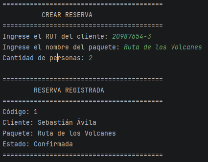
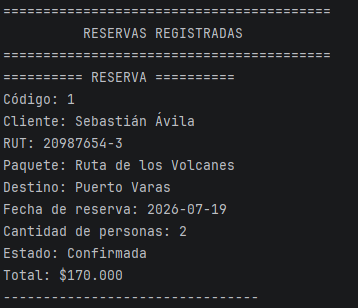

# Llanquihue Tour

## Descripción

Llanquihue Tour es una aplicación de consola desarrollada en Java que permite administrar la información de una empresa de turismo. El sistema gestiona clientes, guías turísticos, proveedores, paquetes turísticos y reservas mediante un menú interactivo.

Este proyecto fue desarrollado como parte de la asignatura **Desarrollo Orientado a Objetos I** de Duoc UC, aplicando los principales conceptos de Programación Orientada a Objetos y buenas prácticas de organización del código.

---

## Objetivo

Desarrollar un sistema que permita registrar y administrar información relacionada con una empresa de turismo, utilizando Java y aplicando principios de Programación Orientada a Objetos.

---

## Funcionalidades

- Cargar información desde archivos de texto.
- Mostrar clientes registrados.
- Mostrar guías turísticos.
- Mostrar proveedores.
- Mostrar paquetes turísticos.
- Registrar reservas.
- Mostrar reservas realizadas.
- Buscar clientes por RUT.
- Buscar paquetes turísticos.

---

## Tecnologías utilizadas

- Java 23
- IntelliJ IDEA
- Maven
- Git
- GitHub

---

## Estructura del proyecto

```text
src
├── app
├── data
├── exceptions
├── interfaces
├── model
└── utils
```

### Descripción de los paquetes

| Paquete | Descripción |
|---------|-------------|
| app | Contiene la clase principal del programa. |
| data | Administra la lógica del sistema. |
| exceptions | Contiene las excepciones personalizadas. |
| interfaces | Define comportamientos comunes mediante interfaces. |
| model | Contiene las clases principales del sistema. |
| utils | Incluye clases de apoyo, como la lectura de archivos. |

---

## Conceptos de Programación Orientada a Objetos aplicados

- Encapsulamiento
- Herencia
- Polimorfismo
- Composición
- Interfaces
- Manejo de excepciones personalizadas

---

## Ejecución del proyecto

1. Clonar el repositorio.
2. Abrir el proyecto en IntelliJ IDEA.
3. Ejecutar la clase `Main`.
4. Utilizar el menú principal para acceder a las distintas funcionalidades.

---

## Capturas del sistema

A continuación se muestran algunas de las principales funcionalidades desarrolladas en el sistema.

### Menú principal



---

### Personas registradas



---

### Paquetes turísticos



---

### Creación de una reserva



---

### Reservas registradas



---

## Estado del proyecto

Proyecto finalizado como parte de la asignatura **Desarrollo Orientado a Objetos I** de Duoc UC.

---

## Autor

**Sebastián Ignacio Ávila Sanhueza**

Estudiante de Analista Programador Computacional

Duoc UC